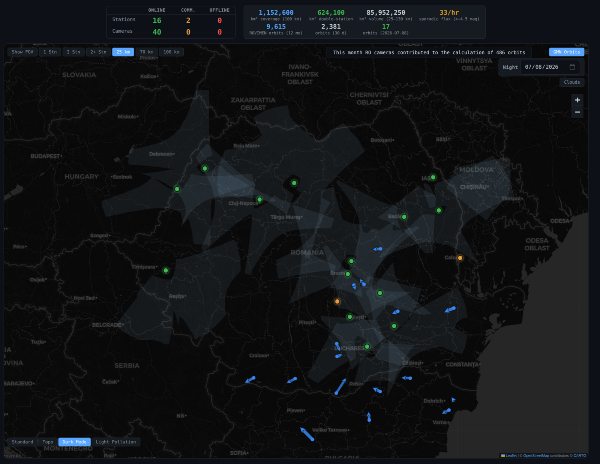
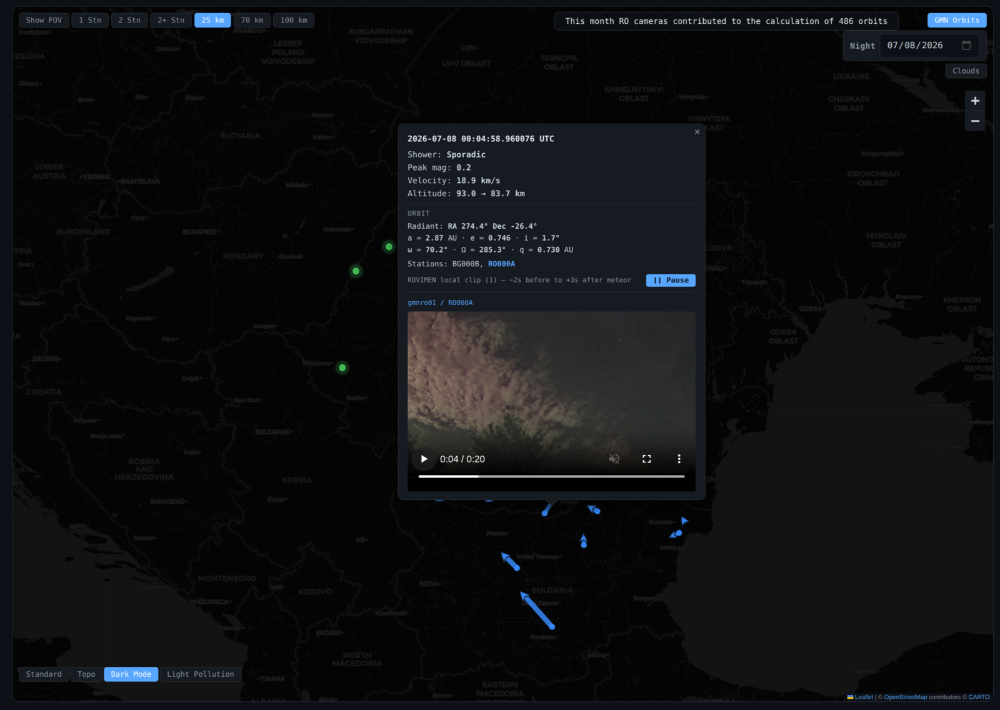
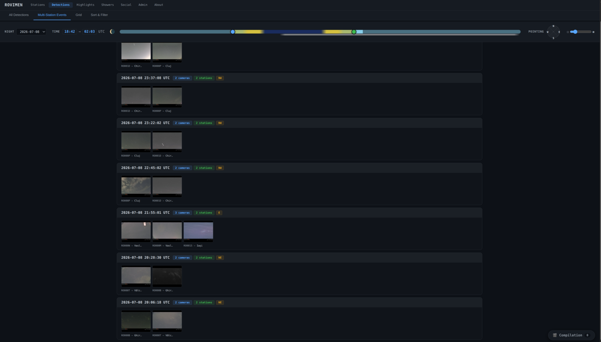
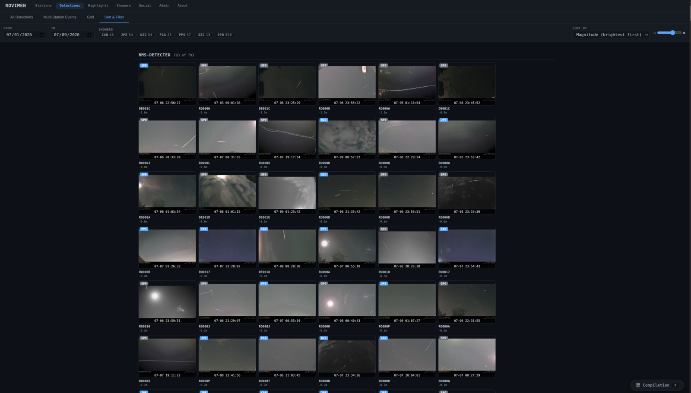
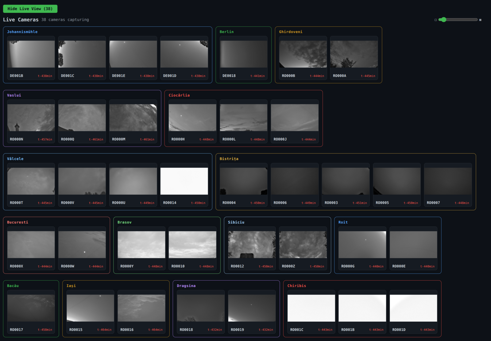
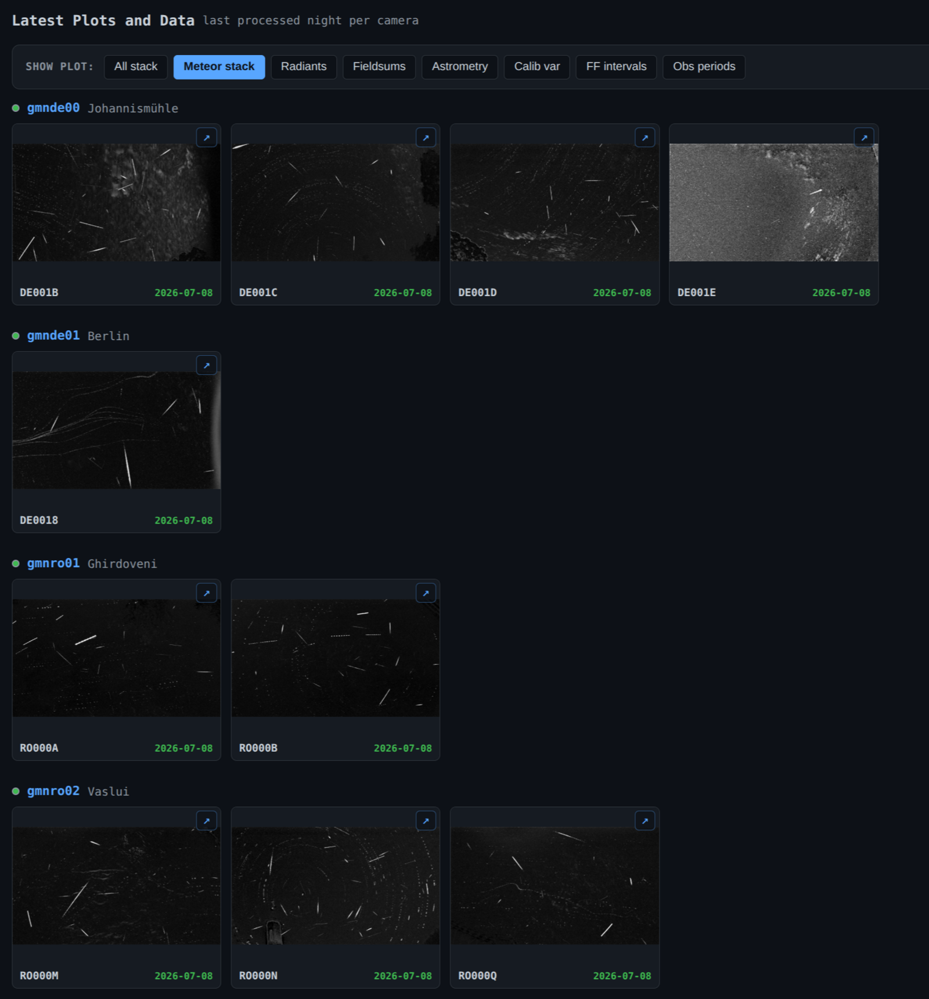

# ROVIMEN Station Tools

Open tooling for [Global Meteor Network](https://globalmeteornetwork.org/) (GMN)
camera stations: video capture, colour calibration, and a fleet-monitoring
dashboard. Built and run for a real multi-station meteor camera network
(15+ stations, two countries, consumer ISPs behind CGNAT), and usable by any
operator running GMN/RMS stations.

> **Status:** public release of tooling extracted from a private operational
> repository. Live network configuration (station IPs, credentials) is **not**
> included — you configure your own. See "Configuration" below.

## About ROVIMEN

ROVIMEN — the ROmanian VIdeo MEteor NEtwork — was founded in 2013 by a group
of astronomy enthusiasts to systematically monitor meteor activity over
Romania with video cameras. Thirteen years on, the network operates 15+
stations with 40+ cameras across Romania and Germany, contributing nightly
observations to the [Global Meteor Network](https://globalmeteornetwork.org/).
This repository contains the tooling that runs that fleet.

## Screenshots

**Fleet overview** — the landing view. Every station on a live map of Romania
and Germany, coloured by status (online / delayed / offline). The header tracks
fleet-wide numbers: total sky area monitored, the double-station volume where
meteors can be triangulated into orbits, and how many orbits the network has
contributed to the Global Meteor Network over the last year, month, and night.
The shaded lobes are the cameras' overlapping fields of view (projected to a
selectable altitude); the blue arrows are that night's computed meteor orbits.



**Orbit detail** — click any orbit and the network resolves it into physics:
shower association, peak magnitude, entry velocity, begin/end altitude, and the
full heliocentric orbit (radiant, semi-major axis, eccentricity, inclination,
argument of perihelion, ascending node, perihelion distance). Contributing
stations are listed, and where ROVIMEN captured a colour clip of the event it
plays inline.



**Multi-station events** — meteors seen at the same instant by two or more
stations, the coincidences that make orbit computation possible. Each row pairs
the thumbnails from every camera that caught the event, tagged with the camera
and station count and the pointing direction; the scrubber at the top filters
by time of night.



**Detections gallery** — every RMS detection over a date range (here 793,
sorted brightest-first). Each thumbnail is one detection labelled with its
camera, meteor-shower code (or SPO for sporadic), peak magnitude, and
timestamp; the shower chips and date pickers narrow the set.



**Live cameras** — the most recent frame from every camera feed, grouped by
station and colour-keyed, each with a freshness counter. At a glance you can
tell which cameras are clear, which are clouded out, and which have gone dark.



**Nightly plots** — for the last processed night, each camera's RMS plots:
meteor stack (shown — every detection of the night composited into one frame),
full-night star-trail stack, radiants, field sums, astrometry residuals,
calibration variance, FF intervals, and observation periods.



## What's here

| Area | Path | What it does |
|------|------|--------------|
| **Dashboard** | `dashboard/` | Flask app that maps your stations, shows detections/events/timelapses, and proxies each station's REST API. Config-driven — no hard-coded stations. |
| **Public API** | `dashboard/public_api.py` | Anonymous, read-only JSON + media surface for embedding data on your own website. See [`docs/public_api.md`](docs/public_api.md) (contract) and [`docs/astromania-integration.md`](docs/astromania-integration.md) (reference consumer). |
| **Station scripts** | `rovimen-scripts/` | Capture, colour calibration, encoding, FPN calibration, night processing, the station REST API, and the updater. Deployed to each station. |
| **Colour calibration** | `lib/color_calibration.py` | Adaptive white balance, highlight-protect, gamma/contrast for colour meteor video. |
| **Open hardware** | `GMN_SQR_V1/` | 3D-printable housings for common camera/board combos (STL). |
| **Deployment** | `deployment/` | Self-extracting station installer generator + camera/network bring-up guides. |
| **Docs** | `docs/` | [Network setup](docs/networking.md), [known failure modes](docs/known_failure_modes.md), [public API](docs/public_api.md), [deployment](docs/deployment.md). |

## Architecture

Three layers, strictly separated — cameras on an isolated LAN, stations and
the dashboard VPS on a private Tailscale overlay, and only the VPS facing the
public internet:

```
 cameras ──RTSP:554──> station PC ──tailnet:7779──> dashboard VPS ──TLS──> public
 (isolated LAN,        (station API,               (Flask + nginx,
  no internet)          capture, upload)            media archive)
```

- The dashboard is a **config-driven proxy**: it reads station metadata from
  `dashboard_config.yaml` and forwards data requests to each station's REST
  API (`rovimen_station_api.py`, port 7779) over the tailnet. Adding a station
  is one YAML entry — no code changes.
- Stations need **no port forwarding, no public IP, no DDNS** — everything
  rides the Tailscale overlay, which traverses CGNAT.
- Cameras are given no default gateway, so camera firmware can never reach
  the internet.

**Read [`docs/networking.md`](docs/networking.md) before deploying** — it
covers the network composition in detail, a sample Tailscale ACL policy
(tags, no station-to-station traffic, cross-tailnet jump hosts), the port
map, firewall rules, and camera LAN conventions.

## Quick start (dashboard)

```bash
uv sync                                   # Python deps (uv)
cp dashboard/dashboard_config.example.yaml dashboard/dashboard_config.yaml
$EDITOR dashboard/dashboard_config.yaml   # add your stations
uv run python dashboard/rovimen_dashboard.py --port 7777
```

The GMN meteor-map overlay figures out which orbits are "yours" from the
camera codes in your config — set `highlight_codes` to render a subset
(e.g. a second site) as a muted secondary overlay.

## Station install

1. Bring up the camera LAN and camera settings per
   [`deployment/docs/CAMERA_NETWORK_SETUP.md`](deployment/docs/CAMERA_NETWORK_SETUP.md)
   (static IPs, CBR H.264, daytime AutoReboot — the defaults will hurt you).
2. Join the station to your tailnet with a tagged auth key
   (see [`docs/networking.md`](docs/networking.md)).
3. Build and run the self-extracting installer:
   `deployment/build_deploy.py` generates `rovimen-deploy.sh`, which installs
   the station scripts, systemd services, and the station API as the station
   user.
4. Add the station to `dashboard_config.yaml`.

## Configuration

- **`dashboard/dashboard_config.yaml`** — your station registry. Copy it from
  the `.example.yaml`. This file is **gitignored**; never commit real IPs,
  SSH users, or camera credentials.
- **`rovimen-scripts/config_defaults.json`** — station capture defaults; edit
  the archive host/path for your own upload target.

## When things break

Start with [`docs/networking.md`](docs/networking.md) § "Frequent problems"
(station offline, nightly frame-drop bursts, camera unreachable, upload bans),
then the full diagnosis catalog in
[`docs/known_failure_modes.md`](docs/known_failure_modes.md) — every
non-obvious failure we've hit in production, each with symptom → root cause →
diagnosis → fix. The short version of the two that hit everyone:

- **Frame drops at the same time every night** — camera firmware AutoReboot
  firing mid-capture on a drifted clock. Set it to a daytime hour.
- **Station "offline" but the PC is up** — check `tailscale status` and ACLs
  before anything else.

## Tests

```bash
npm ci && npm test                        # JS unit tests (vitest)
uv run pytest tests/ -v                   # Python tests
npx playwright test --config tests/e2e/playwright.config.js   # E2E (browser)
```

## Security

See [`SECURITY.md`](SECURITY.md) for how to report a vulnerability. Please do
**not** open public issues for security problems.

## Maintainers

- Alex Tudorica ([@alextudorica](https://github.com/alextudorica))
- Florin Dumitrescu ([@florindumitrescu94](https://github.com/florindumitrescu94))

## License

[GPL-3.0](LICENSE) — matching the RMS/GMN ecosystem.
